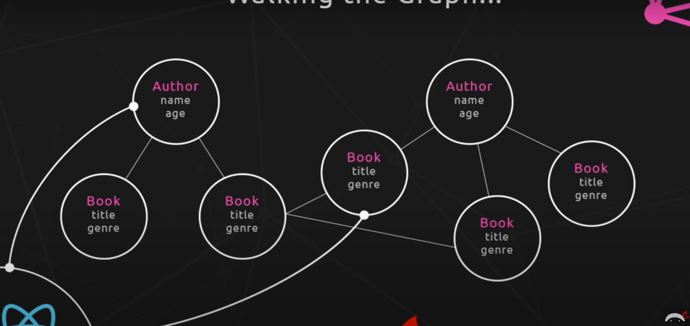
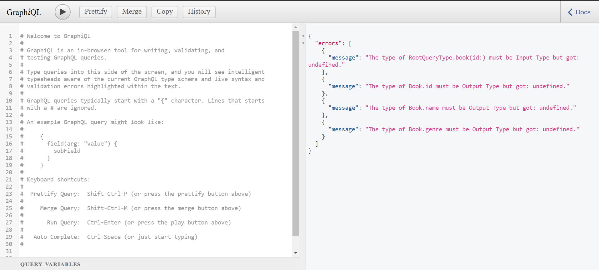
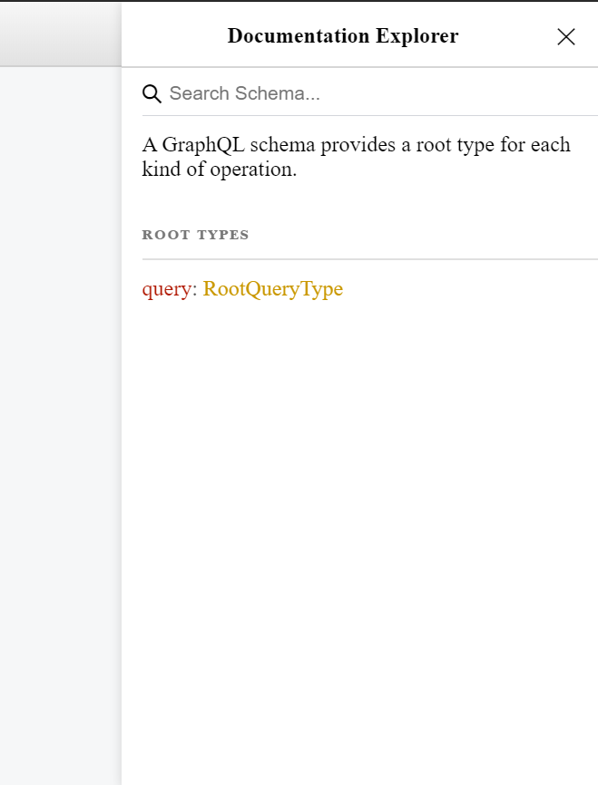
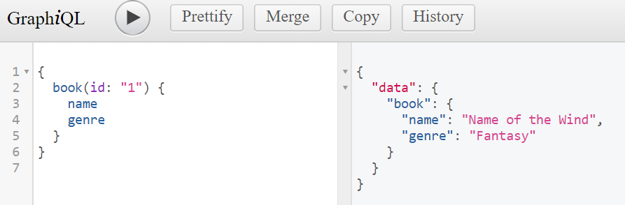

# GraphQL - Dojo

from youtube playlist:

https://www.youtube.com/watch?v=Y0lDGjwRYKw&list=PL4cUxeGkcC9iK6Qhn-QLcXCXPQUov1U7f

### notes from videos:

#### video 1

Frontend will be react js

Backend will be node js.

What is graphql:

It is a poweful query language used between the front-end and server.

#### video 2

This video is about an overview of GraphQL

A rest api make looks like this:

| Action              | Endpoint               |
| ------------------- | ---------------------- |
| Get all books       | domain.com/books       |
| Get a single book   | domain.com/books/:id   |
| Get all authors     | domain.com/authors     |
| Get a single author | domain.com/authors/:id |

GraphQL would look like this:



#### video 3

This is video is about our project structure.

backend:

1. Node.js - Express App as GraphQl Server
2. Database - MongoDB on mLab

frontend:

1. React App - using Apollo

GraphQL is platform agnostic

Graphiql will be used for testing graphql endpoints.

#### video 4

This video is about starting Graphiql.

This is an example of a graphql query

```graphql
{
  books {
    name
    genre
    id
  }
}
```

Another example of getting relational data with a query

```graphql
{
  books {
    name
    genre
    author {
      name
      age
    }
  }
}
```

GraphQL is a query language, it is not JavaScript

#### video 5

This video was creating a simple express app in the new server folder.

#### video 6

This video is about connecting graphql to our new express app.

```bash
npm i graphql
```

```bash
npm i express-graphql
```

How we installed on our app.js express app

```javascript
const express = require("express");
const graphqlHTTP = require("express-graphql");

const app = express();

app.use("/graphql", graphqlHTTP({}));

app.listen(4000, () => {
  console.log("now listening for request on port 4000");
});
```

connecting to http://localhost:4000/graphql has this error

```json
{
  "errors": [{ "message": "GraphQL middleware options must contain a schema." }]
}
```

The schema is missing.

#### video 7

This video is about creating a graphql schema

```javascript
const graphql = require("graphql");

const { GraphQLObjectType, GraphQLString } = graphql;

const BookType = new GraphQLObjectType({
  name: "Book",
  fields: () => ({
    id: { type: GraphQLString },
    name: { type: GraphQLString },
    genre: { type: GraphQLString },
  }),
});
```

#### video 8

This video is about root queries. They are the entry points to the graph.

We added RootQuery to the schema.js file

```javascript
const graphql = require("graphql");

const { GraphQLObjectType, GraphQLString, GraphQlSchema } = graphql;

const BookType = new GraphQLObjectType({
  name: "Book",
  fields: () => ({
    id: { type: GraphQLString },
    name: { type: GraphQLString },
    genre: { type: GraphQLString },
  }),
});

const RootQuery = new GraphQLObjectType({
  name: "RootQueryType",
  fields: {
    book: {
      type: BookType,
      args: { id: { type: GraphQLString } },
      resolve(parent, args) {
        // args.id because we defined id
        // code to get data from db
      },
    },
  },
});

//how the query will look:
// book(id: "123") {
//     name
//     genre
// }

modules.exports = new GraphQlSchema({
  query: RootQuery,
});
```

This was added to the app.js file created in an earlier video

```javascript
const schema = require("./schema/schema");

app.use(
  "/graphql",
  graphqlHTTP({
    schema,
  })
);
```

#### video 9

This video is about the resolve function.

Lodash has been installed.

```JavaScript
npm i lodash
```

Dummy data was created and the resolve is used to search the dummy data using lodash

```javascript
const graphql = require("graphql");
const _ = require("lodash");

const { GraphQLObjectType, GraphQLString, GraphQLSchema } = graphql;

//dummy data
var books = [
  { name: "Name of the Wind", genre: "Fantasy", id: "1" },
  { name: "The Final Empire", genre: "Fantasy", id: "2" },
  { name: "The Long Earth", genre: "Sci-Fi", id: "3" },
];

const BookType = new GraphQLObjectType({
  name: "Book",
  fields: () => ({
    id: { type: GraphQLString },
    name: { type: GraphQLString },
    genre: { type: GraphQLString },
  }),
});

const RootQuery = new GraphQLObjectType({
  name: "RootQueryType",
  fields: {
    book: {
      type: BookType,
      args: { id: { type: GraphQLString } },
      resolve(parent, args) {
        // args.id because we defined id
        // code to get data from db
        return _.find(books, { id: args.id }); // <---- This
      },
    },
  },
});

//how the query will look:
// book(id: "123") {
//     name
//     genre
// }

module.exports = new GraphQLSchema({
  query: RootQuery,
});
```

#### Video 10

This video is about testing queries in Graphiql

Using http://localhost:4000/graphql now will result in the following error:

```json
{ "errors": [{ "message": "Must provide query string." }] }
```

We need a tool to interact with this endpoint.

In the app.js we need to add the graphiql tool:

```JavaScript
app.use('/graphql', graphqlHTTP({
    schema,
    graphiql: true
}));
```

Now if I go to http://localhost/graphql I will see this tool:



There is a exporer on the right to view rootQueryType



All strings must be double quote, no single quotes.



