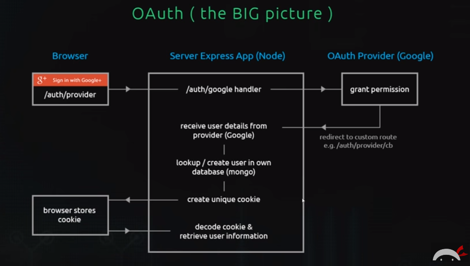

# Passport - Net Ninja

from youtube playlist:

https://www.youtube.com/watch?v=sakQbeRjgwg&list=PL4cUxeGkcC9jdm7QX143aMLAqyM-jTZ2x

### notes from videos

#### video 1

Introduction into OAuth.

#### video 2

This video is about a deeper analysis into OAuth.



#### video 3

This video is about setting up an express app

The folder created was oauth-playlist

```bash
npm init
```

```bash
npm install ejs express --save
```

```bash
npm i nodemon -g
```

#### video 4

This video is about setting up auth routes in application

new routes:
/auth/login
/auth/logout
/auth/google
